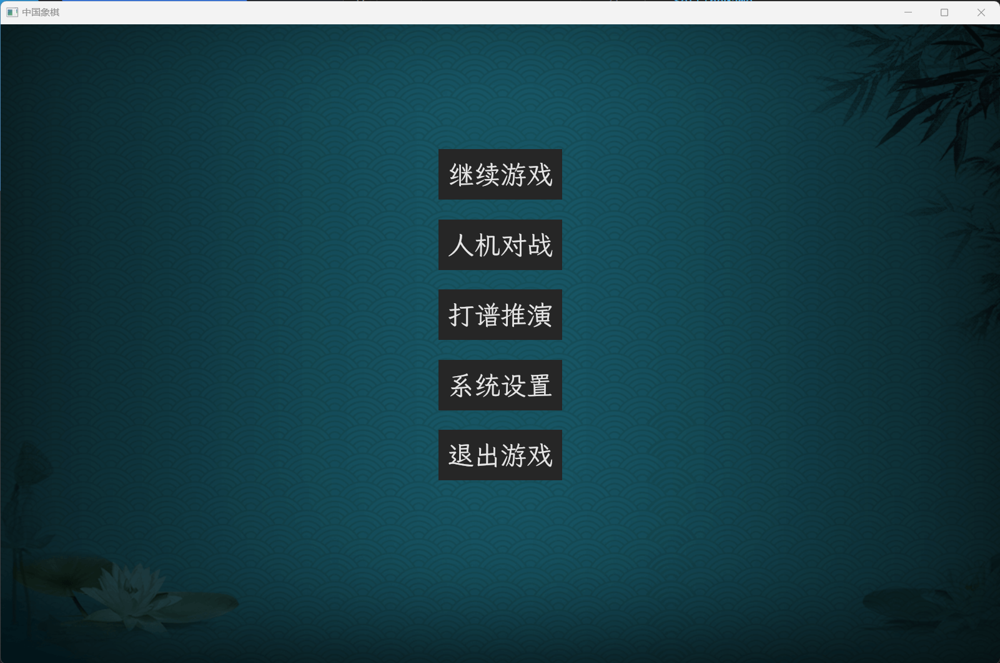
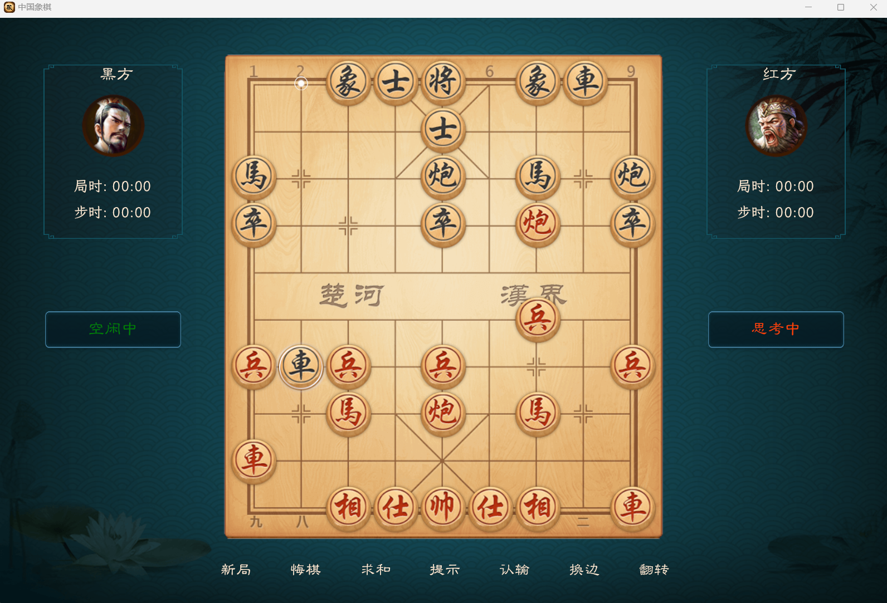

## RuXQ
#### A chess game implemented using the Rust bevy framework
```
Windows11
rustc 1.77.2
cargo build
cargo run
```

#### introduction
 - Elegant background and chessboard, simple yet not simple interaction

 - Fast AI engine, chess power equivalent to Tiantian Chess human-machine, but faster

 - Cross platform, theoretically supporting web/darwin/Linux/windows/android/ios

 - High performance, thanks to the excellent features of Rust, achieving powerful rendering and engine computing with minimal resource consumption

#### game main menu


------------------------------------------------------------------------------

#### windows game


------------------------------------------------------------------------------
## develop

#### todo list

- [ ] System settings menu, resolution, refresh rate, sound, sound effects, etc
- [x] Currently, the resource location is absolute and cannot adapt to various systems, optimizing screen scaling
- [ ] Online game, establish connection using 'Peer to Peer', no central server
- [x] Implementation of Game AI Engine
- [x] Proxy Pikafish engine
- [ ] Timer

#### Calculate whether the point selected by the mouse is within the range of the chess piece
 - A: Mouse selection point
 - B: Center of chess piece circle
 - R: Chess piece radius

$$ \sqrt {\left | {ax-bx} \right |^{2}+\left | {xy-by} \right |^{2}} \ > \ r $$

------------------------------------------------------------------------------

## Reference materials

 - Chess Specification Protocol: https://www.xqbase.com/protocol.htm
 - Chess AI algorithm: https://www.xqbase.com/computer/outline.htm
